# Characters

## Complete
Characters that have been finished and released for free to the public.

| Character | Moveset | Versions |
| :--- | :--- | :--- |
| 
 <a href="../characters/honored-one/" class="gojo-glow">Honored One</a>
 | **Base Moves** • (1) Lapse Blue • (2) Reversal Red • (3) Rapid Punches • (4) Twofold Kick • (R) Limitless  **Six Eyes (Awakening)** • (1) Lapse Blue MAX • (2) Reversal Red MAX • (3) Hollow Purple • (4) Infinite Void • (2 into 1's finisher) Unlimited Purple • (R during Six Eyes) 0.2 Second Domain | **Added:** V1.00 **Finished:** V1.00 |
| 
<a href="../characters/vessel/">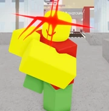</a> <a href="../characters/vessel/" class="sukuna-glow">Vessel</a>
 | **Base Moves** • (1) Cursed Strikes • (2) Crushing Blow • (3) Divergent Fist • (4) Manji Kick • (R) Combat Instincts  **King of Curses (Awakening)** • (1) Dismantle • (2) Open • (3) Rush • (4) Malevolent Shrine • (R) Cleave • (1+3+2+R) World Cutting Slash | **Added:** V1.00 **Finished:** V1.00 |
| 
<a href="../characters/restless_gambler/">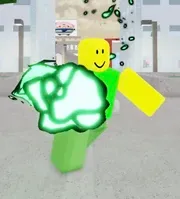</a> <a href="../characters/gambler/" class="hakari-glow">Restless Gambler</a>
 | **Base Moves** • (1) Reserve Balls • (2) Shutter Doors • (3) Rough Energy • (4) Fever Breaker • (R) Fever Breaker • (1 + 1 in domain) Renewal **Idle Death Gamble (Awakening)** • (1) Lucky Volley • (2) Lucky Rushdown • (3) Overwhelming Luck • (4) Energy Surge • (R) Rhythm  | **Added:** V1.00 **Finished:** V1.15 |
| 
<a href="../characters/ten-shadows/">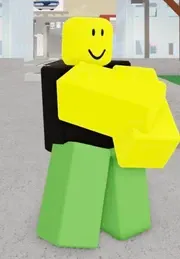</a> <a href="../characters/ten-shadows/" class="shadow-glow">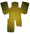Ten Shadows</a>
 | **Base Moves** • (1) Rabbit Escape • (2) Nue • (3) Toad • (4) Divine Dog: Totality • (R) Lurking Shadow  **Insanity (Awakening)** • (1) Max Elephant • (2) Great Serpent • (3) Shadow Swarm • (4) Mahoraga • (R) Lurking Shadow • (G) Switch • (3 on domain border) Chimera Shadow Garden <a href="../characters/mahoraga/" class="mahoraga-glow">Mahoraga</a> • (1) Divine Pummel • (2) Ground Pitch • (3) Earthquake • (4) Takedown/Adaptation/World Slash • (R) Adaptation Wheel | **Added:** V1.15 **Finished:** V1.29 |
| 
<a href="../characters/perfection/">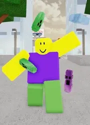</a> <a href="../characters/perfection/" class="perfection-glow">Perfection</a>
 | **Base Moves** • (1) Stockpile • (2) Soul Fire • (3) Focus Strike • (4) Body Repel • (R) Self-Transfiguration  **Essence of the Soul (Awakening)** • (1) Idle Transfiguration • (2) Body Disfigure • (3) Spike Wrath • (4) Embodiment of Self Perfection • (R) Self-Transfiguration • (G) Awakening Black Flash  **Instant Spirit Body of Distorted Killing** • (1) Widespread Strikes • (2) Face Blitz • (3) Crushing Rushdown • (4) Head Splitter • (R) N/A | **Added:** V1.23 **Finished:** V1.40 |
| 
 <a href="../characters/blood-manipulator/" class="blood-glow">Blood Manipulator</a>
 | **Base Moves** • (1) Piercing Blood • (2) Flowing Red Scale • (3) Supernova • (4) Blood Edge • (R) Convergence  **Duty As A Brother (Awakening)** • (1) Slicing Exorcism • (2) Wing King • (3) Blood Rain • (4) Plasma Wave • (R) Convergence | **Added:** V1.39 **Finished:** V1.42 |
| 
 <a href="../characters/switcher/" class="switcher-glow">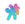Switcher</a>
 | **Base Moves** • (1) Swift Kick • (2) Brute Force • (3) Pebble Throw • (4) Elbow Drop • (R) Boogie Woogie  **False Memories (Awakening)** • (1) Idol's Debut • (2) Climax Jumping • (3) Dreams • (4) Brothers • (R) Boogie Woogie | **Added:** V1.42 **Finished:** V1.49 |
| 
 <a href="../characters/defense-attorney/" class="attorney-glow">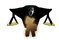Defense Attorney</a>
 | **Base Moves** • (1) Extended Swings • (2) Justice Served • (3) Judgement's Reach • (4) Twirling Strikes • (R) No Escape  **Deadly Sentencing (Awakening)** • (1) Execution • (2) Final Judgement • (3) Verdict • (4) Triple Sentence • (R) Domain Amplification | **Added:** V1.50 **Finished:** V1.57.1 |
| 
<a href="../characters/cursed-partners/">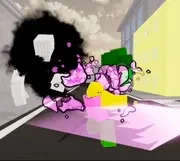</a> <a href="../characters/cursed-partners/" class="partners-glow">Cursed Partners</a>
 | **Base Moves** • (1) Severing Path • (2) Resolute Slash • (3) Veilstep • (4) Revolve • (R) Rika • (R+1) Rika Downslam • (R+2) Rika Launch • (R+3) Rika Throw • (R+4) Rika Haymaker  **True Love (Awakening)** • (1) Elbow Rush • (2) Copy • (3) True Love Beam • (4) Authentic Mutual Love • (R) Rika • (R+1) Rika Downslam • (R+2) Rika Launch • (R+3) Rika Slam • (R+4) Rika Grab | **Added:** V1.58 **Finished:** V1.63 |
| 
<a href="../characters/head-of-the-hei/">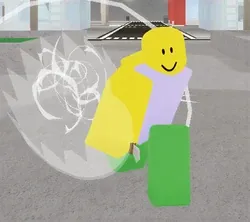</a> <a href="../characters/head-of-the-hei/" class="hei-glow">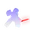Head of the Hei</a>
 | **Base Moves** • (1) Projection Breaker • (2) Bleedout • (3) Decisive Strike • (4) Cursory Impact • (R) Projection Sorcery  **Vengeance (Awakening)** • (1) Top Speed • (2) Frame Freezing • (3) Tendril Grab • (4) Time Cell Moon Palace • (R) Acceleration | **Added:** V1.65 **Finished:** V1.69 |

## Early Access
---
Early Access characters, unfinished characters obtainable by owning the '[Early Access](../game-passes/)' gamepass purchasable for **300** .

| Character | Moveset | Versions |
| :--- | :--- | :--- |
| 
<a href="../characters/puppet-master/">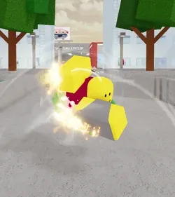</a> <a href="../characters/puppet-master/" class="puppet-glow">Puppet Master</a>
 | **Base Moves** • (1) Ultra Spin • (2) Boost On • (3) Ultra Cannon • (4) Heat Emission • (R) Offload  **Absolute (Awakening)** • (1) Miracle Cannon • (2) Pigeon Viola • (3) Absolute Destruction • (4) *Technique Charge* • (R) *Energy Output* | **Added:** V1.63 **Finished:** WIP |
| 
<a href="../characters/salaryman/">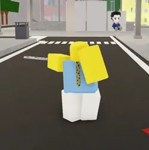</a> <a href="../characters/salaryman/" class="salaryman-glow">Salaryman</a>
 | **Base Moves** • (1) Cleaving Whirlwind • (2) Severance Kick • (3) Blunt Cut • (4) Stabilize • (R) Ratio Point  **Overtime (Awakening)** • (1) Ratio Breaker • (2) *TBA* • (3) *TBA* • (4) Collapse • (R) Ratio Point | **Added:** V1.69 **Finished:** WIP |

## Base Only
---
Base Only characters, accessible immediately upon release, while having their full Awakening replaced by a single move.

| Character | Moveset | Versions |
| :--- | :--- | :--- |
| 
<a href="../characters/locust-guy/">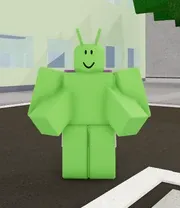</a> <a href="../characters/locust-guy/" class="locust-glow">Locust Guy</a>
 | **Base Moves** • (1) Clever • (2) Black Mucus • (3) Crushing Jaws • (4) Wing Throw • (R) Fluttering Pounce  **Directed Poison** | V1.49 |
| 
<a href="../characters/star-rage/">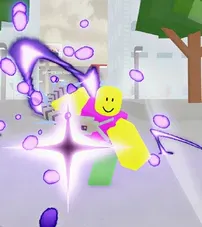</a> <a href="../characters/star-rage/" class="star-glow">Star Rage</a>
 | **Base Moves** • (1) Garuda Rebound • (2) Rising Rage • (3) Mass Breaker • (4) Garuda Stab • (R) Mass Buildup  **Unrestricted Density** | V1.56 |
| 
<a href="../characters/aspiring-mangaka/">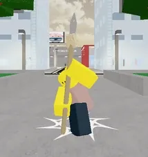</a> <a href="../characters/aspiring-mangaka/" class="mangaka-glow">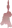Aspiring Mangaka</a>
 | **Base Moves** • (1) Despair • (2) Shut Up! • (3) Eye Catching • (4) Sacrilege • (R) Clairvoyance  **Foresight** | V1.58 |

## Overpowered
---
Overpowered characters, only accessible under special conditions such as Roulette modes, private server commands, or special access given to staff.

| Character | Moveset | Versions |
| :--- | :--- | :--- |
| 
 <a href="../characters/strongest-of-history" class="strongest-glow">Strongest Of History</a>
 | **Base Moves** • (1) Strong Dismantle • (2) Open FURNACE • (3) Cleave Rush • (4) Kamutoke • (R) Incantation • (R + 1) Dismantle Barrage • (R + R + 1) Disgraced Sovereign • (R + R + R + 1) World Cutting Slash • (R + R + R + R) Dismantle Net  **Incomplete Shrine** | V1.45 |
| 
 <a href="../characters/monkey-kid" class="monkey-glow">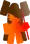Monkey Kid</a>
 | **Base Moves** • (1) Kamehameha • (2) Staff Uppercut • (3) Staff Extend • (4) Ki Spam • (R) Instant Transmission  **Monkey** | V1.69 |

## Developer Specials
---
Developer Only Characters are used on certain occasions for content creators to showcase, for developers to test, or contributors/testers/moderators to mess around with. This makes these characters difficult to document, as it's impossible to get legitimate information without having access to the character itself.

| Character | Moveset | Versions |
| :--- | :--- | :--- |
| 
<a href="../characters/super-tze">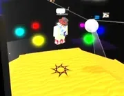</a> <a href="../characters/super-tze" class="super-glow">Super TZE</a>
 | **Base Moves** • (Q) Sonic Boom • (M1) Super Punch • (R) Lock-On • (M1 + Q) Energy Volley | V1.50 (?) |
| 
<a href="../characters/mokou">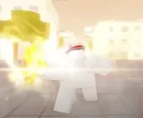</a> <a href="../characters/mokou" class="mokou-glow">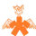Mokou</a>
 | **Base Moves** • (1) Phoenix Maelstrom • (2) Aetherflare Talon • (3) Scorchrise • (4) Hexflare Charm • (R) Phoenix Immortality  **Immortal Blaze** | V1.60 (?) |