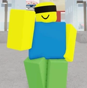

# Honored One

  
  

    <strong>Finished Work</strong> 
    The game developers have finished making Honored One and it is now free for the public to use. 
    <em>• Note: You're still allowed to add new information.</em>
  

*(Not to be confused with the emote "Honored")*

> "Throughout Heaven and Earth, I alone am the Honored One."
> — Satoru Gojo (Honored One), to Toji Fushiguro

---

## Description
Honored One is one of the first three characters added into the *Jujutsu Shenanigans* roster. He is known for his high mobility and the devastating **Hollow Purple** awakening move.

### Info Card

  
Honored One

  
  <table style="width: 100%; color: white; margin: 0;">
    <tr><td><b>Character</b></td><td>Satoru Gojo</td></tr>
    <tr><td><b>Cost</b></td><td>Free</td></tr>
    <tr><td><b>Awakening</b></td><td>Six Eyes</td></tr>
  </table>

## Moveset
### Base
* **(1) Lapse Blue**: Pulls enemies toward the user.
* **(2) Reversal Red**: Blasts enemies away with high knockback.
* **(3) Rapid Punches**: A flurry of melee strikes.
* **(4) Twofold Kick**: A double-hitting physical attack.
* **(R) Limitless**: Teleportation/Dodge mechanic.

### Six Eyes (Awakening)
* **(1) Lapse Blue MAX**
* **(2) Reversal Red MAX**
* **(3) Hollow Purple**
* **(4) Infinite Void**