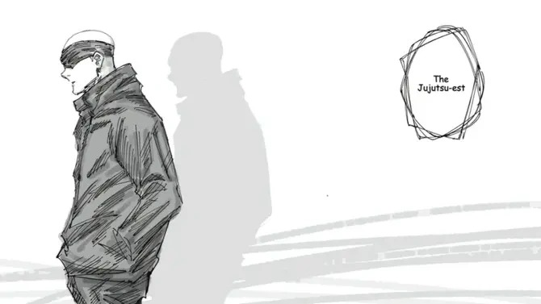
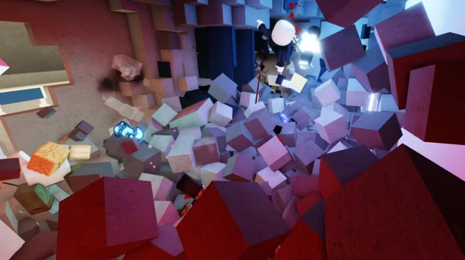
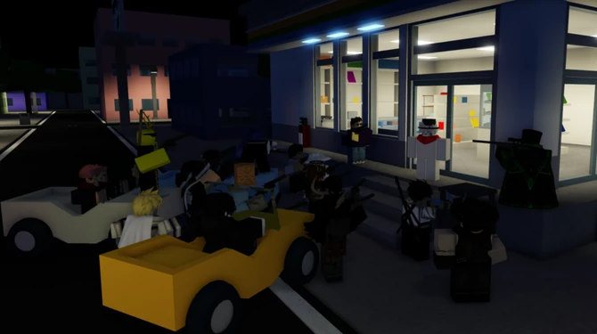
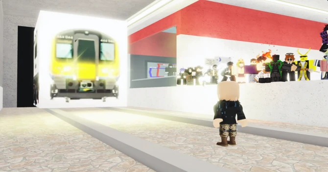
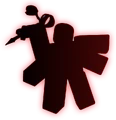
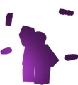

# Welcome to the Jujutsu Shenanigans Wiki
---

The ultimate wiki dedicated to the Roblox battlegrounds game, **[Jujutsu Shenanigans](https://www.roblox.com/games/9391468976/Jujutsu-Shenanigans)**, developed by **[Tze](https://www.patreon.com/MaybeTze)**.

  

    
    
    
    
  

  
  <button class="prev" onclick="changeSlide(-1)">&#10094;</button>
  <button class="next" onclick="changeSlide(1)">&#10095;</button>

---

    Navigation

|  |  |  |  |
| :---: | :---: | :---: | :---: |
| **Game Characters** | **Update Logs** | **Game Controls** | **Official Discord** |
